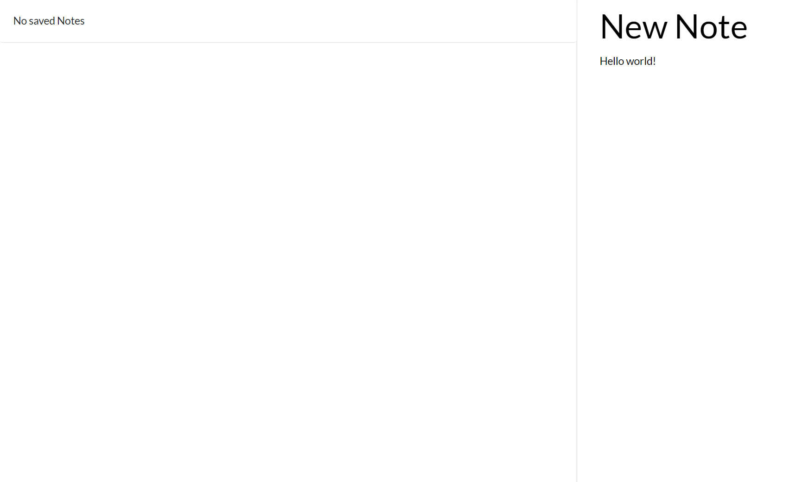
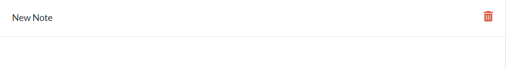

# Note Taker

## Table of Contents

* [General Info](#general-info)
* [Technologies](#technologies)
* [Features](#features)
* [How to Use](#how-to-use)
* [Application Demo](#application-demo)
* [Application Link](#application-link)
* [License](#license)
* [Contact](#contact)

## General Info

An application that can be used to write, save, and delete notes. This application uses an express backend, and saves and retrieves note data from a JSON file.

## Technologies

* HTML
* CSS
* JavaScript
* Express

## Features

* After connecting to local host 3000, the user is able to write a note, save the note, and then delete the note

## How to Use

After downloading the code, connect to local host 3000 using nodemon. Click on Get started, then type text into the header and body of the empty note. After entering information, select the save icon in the upper righthand corner. When the page has been refreshed, the user will be able to see the header of the note and, upon clicking on the header, will be able to view and edit the entirity of the note. If the user wishes to delete the note, they may click on the trashcan icon to the right of the header of the saved note.

## Application Demo

[Demo](https://drive.google.com/file/d/1VqgXiYdvK0UIqWvzN4PWLKQHWeB0STk1/view?usp=sharing)

## Application Link

## License

ISC

## Contact

* Email: jones.m.kasey@gmail.com

* GitHub: https://github.com/joneskm72